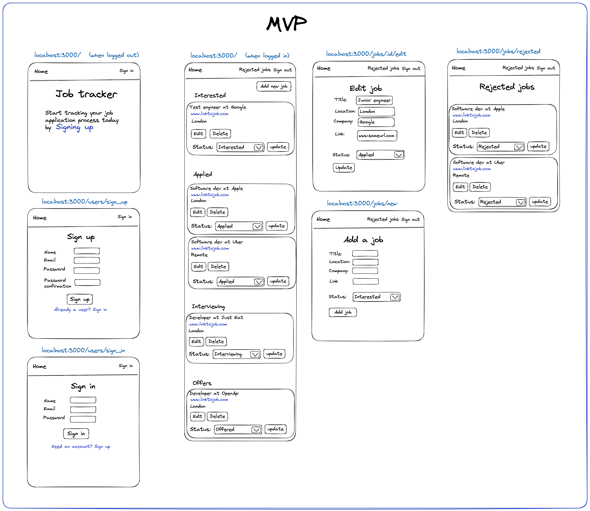

# Job tracker project

This repo is a guide to building a job tracking application. 

The purpose is to give someone who is looking to learn web development (or a new language/framework) a 
project with the product and steps already defined. 

I've designed the application using [wireframe](https://balsamiq.com/learn/articles/what-are-wireframes/)
(built with [excalidraw](https://excalidraw.com/)) that shows the [MVP](https://en.wikipedia.org/wiki/Minimum_viable_product) and tickets
that we'll be using to build it. You can access a read-only version via excalidraw [here](https://excalidraw.com/#json=GagiUh2c-K76wbxHYcIcG,2jGQGZpYCUptSxT9cvJsPQ)
or if you want to edit it you can upload the `mvp-and-tickets.excalidraw` file to https://excalidraw.com/.

## The application you're building

You will be building a job tracking application that people can use to manage the jobs they are applying to 
and the subsequent steps in the process (interviewing/offers etc).

You can see the finished MVP wireframe here: 

Note that the images use `locahost:3000` because this is the default port for the rails framework. Your framework 
may use a different one which is totally fine - no need to change it.

## The tickets you'll be working on

If the above image looks a little overwhelming don't worry - following the advice of 
"how can you eat an elephant?" (one bite at a time!) we've broken this difficult problem into smaller 
sequential steps. 

You can get these tickets by cloning [this trello board](https://trello.com/b/rqZoLhCB/job-tracker-template) 
([how to clone a trello board](https://support.atlassian.com/trello/docs/copying-cards-lists-or-boards/#:~:text=You%20can%20even%20copy%20entire,copy%20cards%20and%20their%20descriptions.) 
in case you need it).

There is a suggested order which you're free to break but if followed you can see the evolution of this app in 
this diagram (the images are included in the tickets).

## Workflow 

If it's possible then I would advise finding a technical mentor to help you with this project and give you feedback 
as you build it following a fairly normal developer workflow: 

1. Refine ticket(s) with the mentor and move to "To do" column (don't have to do this all at once but you shouldn't work on a ticket until it's refined)
2. Pick up a ticket by moving 1 (and only ever 1) ticket to "Doing" column
3. Create a new github branch locally with a name appropriate to the ticket
4. Raise at least 1 PR (totally fine and often better to raise multiple PRs for a single ticket) and send link to mentor
5. Mentor checks, makes comments (which you would address by answering or making changes) and then approves 
6. Merge your branch into master by clicking the "Merge" button on your PR
7. Move your ticket to "Done" column 
8. Locally do a `git checkout main` then `git pull` and go back to step 2!

