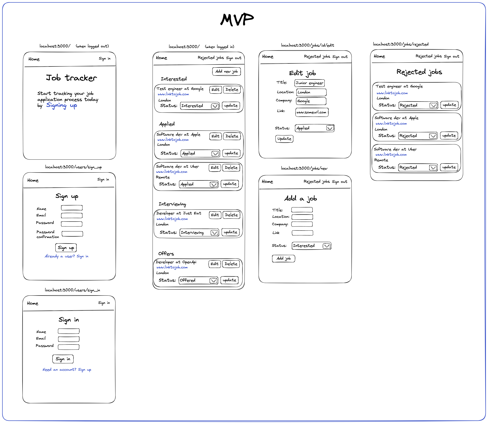

# Job tracker project

This repo is a guide to building a job tracking application. 

The purpose is to give someone who is looking to learn web development (or a new language/framework) a 
project with the product and steps already defined. 

## The application you're building

You will be building a job tracking application that people can use to manage the jobs they are applying to 
and the subsequent steps in the process (interviewing/offers etc).

Here is a [wireframe](https://balsamiq.com/learn/articles/what-are-wireframes/) 
(built with [excalidraw](https://excalidraw.com/)) that shows the [MVP](https://en.wikipedia.org/wiki/Minimum_viable_product). 
(you can access a read-only version via excalidraw [here](https://excalidraw.com/#json=lRKMFB2BEzC_zwoTFY77L,UpCT1d3XIwEY8uUpjqLXuA)).

## The tickets you'll be working on

Tickets for making this application can be found on [this trello board](https://trello.com/b/rqZoLhCB/job-tracker-template)
